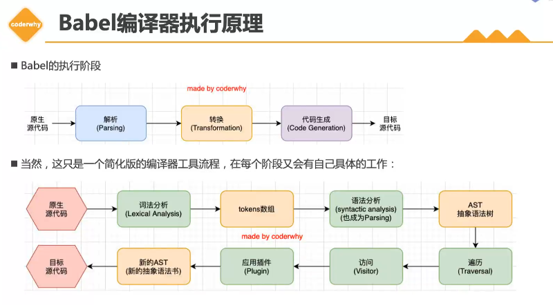
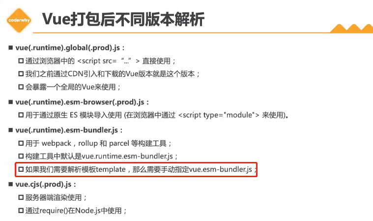
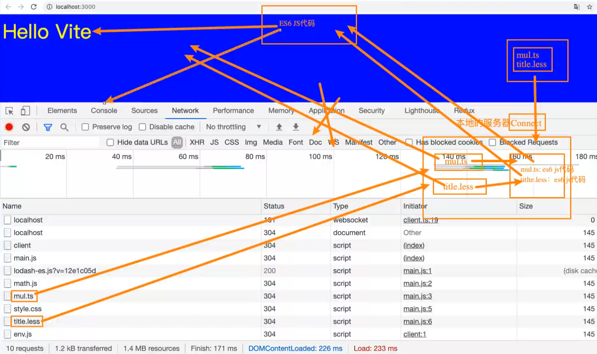

## webpack概念
- `loader`：loader相当于一个帮助库，帮助我们去加载或转换某些模块
- `plugin`：plugin插件可以执行更为广泛的任务，可以完成loader完成不了的事(打包优化、资源管理、环境变量注入)，贯穿整个webpack的生命周期
- `public`：public文件夹在项目中一般除了`index.html(模板)`之外，都是直接复制过去dist打包后的文件夹中例如favicon.icon这种图标文件

&emsp;

## webpack安装
npm基于node环境运行，必须先安装好node环境v12版本以上才可
- `npm init` 初始化项目文件夹，自动生成`package.json`包管理文件
- `npm install webpack webpack-cli -g` 全局安装webpack(学习时)

- `npm install webpack webpack-cli -D` 项目内局部安装，-D(--save-dev简写)代表该包仅在开发环境下使用，如果不加-D则代表在生产环境下使用，不区分也没关系不影响运行，但是为了规范最好区分包的用途是在生产还是在开发阶段。

&emsp;

## webpack打包项目(*.js)
打包流程：
- 1、当执行webpack打包指令后，如果项目目录下有创建 `webpack.config.js` 配置文件的话，就会去到配置文件找自定义的配置信息进行配置(如自定义入口出口)
- 2、如果没有创建webpack.config.js配置文件的话webpack会默认去到src文件夹中找index.js(入口)，根据index.js文件中的依赖，再进一步往下打包，生成dist文件夹(出口)。

&emsp;

### webpack 打包指令
- `webpack` 直接输入执行webpack是从`全局`去找项目进行打包，生产dist文件夹

- `npx webpack` npx会优先找`当前项目`的node_modules里的webpack文件去打包当前项目

- `package.json` (npm init生成) 在包的配置文件中配置 `scripts:{"build":"webpack"}` 这样就很方便，执行指令 `npm run build` 即可完成打包，为什么这边对当前项目打包不需要加上 `npx` 呢，这是因为在package.json中配置命令后，会默认优先找本地的node_modules下的webpack文件进行项目打包。


&emsp;

### webpack 自定义打包的入口与出口
- 在 `webpack.config.js` 配置文件中配置webpack的入口文件和出口目录，需要注意的是由于webpack由node开发，所以读取config文件也是node的方式读取，就不能写ES6的相关语法，如导入导出文件的ES6写法(import、export)，需要用node模块化的导入导出写法。

```js
const path = require("path")

module.exports = {
    entry: "./src/main.js",   // 入口文件
    output: path.resolve(__dirname,"./build"), // 出口目录
    filename: "bundle.js"   // 打包后的js文件名称
}
```

&emsp;


## 打包资源
- loader加载顺序很重要，需要注意！，asset module type则无需顺序要求
### webpack打包css文件(*.css)
- 1、 `npm install css-loader -D` 安装css-loader库,用于加载css文件

- 2、 `npm install style-loader -D` 安装style-loader库，由于渲染样式，没有style-loader，css也是不起作用的

- 3、在 `webpack.config.js` 中使用module.rules属性，配置loader所要匹配的文件和loader的加载顺序(从后往前，先加载的loader要写在最后)
```js
const path = require('path')
module.exports = {
    entry: "./src/main.js",
    output:{
        path:path.resolve(__dirname,"./build"),
        filename:"bundle.js"
    },
    module:{    // 配置loader插件
        rules:[
            {
                test: /\.css$/, // 正则表达式 匹配css文件
                // 1、写法1(语法糖) 使用单个loader。只有css-loader(只负责加载css文件) css样式还是不起作用所以这边用写法2
                // loader: "css-loader"
                
                // 2、完整写法2 一种文件类型使用多个loader处理
                // 多个loader是有执行顺序的，从后往前，所以css-loader要在最后
                use:[
                    "style-loader",
                    "css-loader"
                ]
            }
        ]
    }
}
```

&emsp;

### webpack打包less文件(*.less)
- `npm install less-loader -D` 打包less文件依赖于lessc这个包，但是我们可以直接装less-loader，内部会直接帮我们执行lessc对less文件进行转义打包
- 配置方式与css-loader一样,由于需要先找到less文件再将其转为css文件再渲染样式，所以这边依赖了三个loader，顺序很重要，不能乱放！
```js
// webpack.config.js 

module:{    // 配置loader插件
    rules:[
        {
            test: /\.less$/,
            use:[
                "style-loader",
                "css-loader",
                "less-loader"
            ]
        }
    ]
}
```

&emsp;

### webpack打包图片文件
### file-loader webpack5写法
1、图片显示
- 在webpack5中file-loader、url-loader都给更新成了Asset Modules type，之前都是需要安装相应的loader后再配置rules，图片或者其他静态文件才能够进行打包，但是在webpack5的版本中，安装后配置rules反而不显示图片，不安装反倒显示图片！。
- webpack5现在无需安装loader，使用Asset Modules type即可打包并显示图片，使用方法如下：
```js
// webpack.config.js 

module:{
    rules:[
        {
            test: /\.(jpe?g|png|gif)$/i,
            type: 'asset/resource'
        }
    ]
}
```
2、图片路径及名称自定义
- 在 `webpack.config.js` > `output` 下配置 `assetModuleFilename` 即可，写法如下：

- 常用placeholder(占位符)：
    - `[ext]`: 处理文件的扩展名
    - `[name]`: 处理文件的名称
    - `[hash]`: 文件的内容，md4加密处理，生成128位的hash值
    - `[hash:length]`: 截取hash长度，默认32个字符太长了
    - `[path]`: 文件相对于webpack配置文件的路径

- 例：打包后放在img文件夹中，且图片名称格式为 `图片名称.6位hash值.文件后缀名`
```js
output:{
    path:path.resolve(__dirname,"./build"),
    filename:"bundle.js",
    assetModuleFilename: 'img/[name].[hash:6][ext]'
},
```

&emsp;

### url-loader webpack5写法
#### 1、url-loader与file-loader的区别
- url-loader和file-loader的作用一样，都是对静态资源文件做一个打包，唯一不同的是，file-loader不管文件多大或者多小都会直接对文件去打包，那么在实际的浏览器请求服务器页面资源的场景中，如果一个页面有大大小小很多张图片，不管图片大或小，每次都要请求，这样显然是很浪费服务器资源的。
- 鉴于上述资源浪费的问题，url-loader可以让我们指定文件的最大内存，如果文件内存低于我们设置的最大内存，则将文件转为base64编码格式放进js文件中，如果大于则正常打包文件，这样我们就可以把一个个小图片直接转化成编码，节省请求资源的次数，大图片就没必要转，转出来的base64编码也会很大。

#### 2、图片名称路径自定义及文件内存限制
- 注：常用`generator`设置路径，`output->assetModuleFilename`设置路径的方式用的较少，二者选其一即可
```js
// webpack.config.js 

module:{
    rules:[
        {
            test: /\.(jpe?g|png|gif)$/i,
            type: 'asset',
            // 路径设置 
            generator: {
                filename: 'img/[name]_[hash:6][ext]'
            },
            // 规则设置
            parser:{
                dataUrlCondition: {
                    // 文件小于100kb就打包成base64编码放进js文件，大图片就不用，小图片转成编码，优化请求资源消耗。
                    maxSize: 100 * 1024
                }
            }
        }
    ]
}
```

&emsp;

### webpack打包字体文件
- 利用webpack5的asset module type方式打包，字体文件一般不需要转为base64编码，所以使用`asset/resouce`类型
```js
// webpack.config.js 

module:{
    rules:[
        {
            test: /\.(eot|ttf|woff2?)$/,
            type: 'asset/resource',
            generator:{
                filename: 'font/[name]_[hash:6][ext]'
            }
        }
    ]
}
```

&emsp;

### webpack5 静态资源文件配置参考文章
- [深入 Webpack5 等构建工具系列三(4) - Asset Modules type](https://juejin.cn/post/7002250229705605150)

&emsp;


## 插件(Plugin)
- plugin顺序无需顺序要求，随意放

### CleanWebpackPlugin 清除文件夹插件
- 作用：在之前打包项目文件的时候，上次打包的内容还会存在，并不会和新的打包内容进行覆盖，也不会先清除原有文件后再添加新文件，而`CleanWebpackPlugin`插件就能做到在打包时先清除打包文件夹。
- `npm install clean-webpack-plugin -D` 安装plugin插件到项目
```js
// webpack.config.js 

const {CleanWebpackPlugin} = require('clean-webpack-plugin')

module.exports = {
    ...
    plugins:[
        new CleanWebpackPlugin(),
    ]
}
```

&emsp;

### HtmlWebpackPlugin 打包html模板文件
- 作用：在之前打包项目文件的时候，打包文件夹中并没有index.html的文件，调试时都是在src下的index.html直接打开进行显示，但是在实际的部署场景中，打包后的部署文件夹中是必须要有index.html文件的，而`HtmlWebpackPlugin`插件就能做到创建默认html模板或自定义html模板打包进部署文件夹中并自动引用js文件。
- `npm install html-webpack-plugin -D` 安装plugin插件到项目
```js
// webpack.config.js 

const {HtmlWebpackPlugin} = require('html-webpack-plugin')

module.exports = {
    ...
    plugins:[
        // new HtmlWebpackPlugin() 不填写options参数的话则创建默认模板
        new HtmlWebpackPlugin({
            template:'./src/public/index.html', // 模板html文件路径
            title:'html页面title自定义'
        }),
    ]
}
```

&emsp;

### DefinePlugin 声明html中的EJS嵌入式变量
- 作用：在`vue-cli`脚手架模板中，`public/index.html`就是脚手架自动创建的模板文件，我们将该文件直接复制到自己的webpack项目下同样放在public文件夹下，直接执行打包的话会报错，错误信息说是html文件中的`BASE_URL`未定义，这个变量是EJS的语句，那么如何定义声明EJS变量呢？，这就需要用到`DefinePlugin`插件自定义EJS变量。
- 该plugin插件为webpack自带，无需npm安装
```html
<!-- index.html -->
<link rel="icon" href="<%= BASE_URL %>favicon.ico">
```

```js
// webpack.config.js 

const {DefinePlugin} = require('webpack') 

module.exports = {
    ...
    plugins:[
        new DefinePlugin({
            // BASE_URL:"xxx"写法标识引用xxx这个变量的值
            // 如果想要直接赋值需要在双引号下写单引号再写值"'xxx'"
            BASE_URL:"'./'"
        }),
    ]
}
```

&emsp;

### CopyWebpackPlugin 复制文件到指定文件夹(例：favicon.ico)
作用：在`vue-cli`脚手架模板中，`public/favicon.ico`，在打包的时候需要直接复制过去打包的部署文件夹`dist`中，但是手动复制很麻烦，如果public中还有一些其他的文件那么一个个复制就很繁琐，`CopyWebpackPlugin`插件就可以帮我们将文件自动复制过去，并且可以设置需要省略不复制的文件。


```js
// webpack.config.js 

const CopyWebpackPlugin = require('copy-webpack-plugin') 

module.exports = {
    ...
    plugins:[
        new CopyWebpackPlugin({
            patterns:[
                {
                    from:'./src/public',
                    // to: 可省略不写，插件会自动读取配置上下文
                    globOptions:{   // globOptions配置参数
                        ignore:[    // ignore忽略文件
                            "**/index.html"  // **代表./src/public路径下的所有目录
                        ]
                    }
                }
            ]
        })
    ]
}
```

&emsp;

## (掌握)mode和devtool配置项
- 作用：在打包项目文件时，webpack只会检查项目文件的依赖，并不会校验js文件中的语句是否有错，不管有没有错都会打包成功，虽然在浏览器的开发者工具中有错误信息抛出，但是都是指向的`bundle.js`也就是打包压缩之后的js文件，密密麻麻一团(如图1、2所示)，也不知道到底是哪个语句在哪个文件中出错，这就需要配置`mode`和`devtool`,来让代码能够让我们读懂，并且能够指向具体的错误文件及错误语句。

- `mode`：采用哪一种模式进行打包，设置为以`development`生产模式进行打包后，bundle.js文件不被压缩了,需要注意的是，这只是为了开发时调试方便，在准备打包上线时，需要设置`production`模式！

- `devtool`：设置开发时的工具，默认值为`eval`，所以只写mode时，bundle.js包含很多eval函数，要想能看得懂代码就得设置成`source-map`，设置source-map，建立js映射文件，方便调试代码和查看错误信息(f12控制台)
```js
// webpack.config.js

module.exports = {
    // mode与devtool一般都写在webpack配置项的最前面
    mode: "development",
    devtool: "source-map",
}
```


&emsp;

## babel编译转义
- 作用：babel是个编译器，允许你使用新的语法，无需等待浏览器支持，babel会自动把ES6以上的语法(例如const、let、箭头函数)转为浏览器可支持的ES5以下的语法语句。


&emsp;

### 预设方式配置webpack babel (预设和plugin二选其一)
- 1、`npm install @babel/core @babel/cli -D`
- 2、`npm install @babel/preset-env -D`
- 3、`npm install babel-loader -D`
- 4、根目录创建`babel.config.js`单独存放babel配置
- 5、配置webconfig的loader
```js
// babel.config.js
module.exports = {
    presets:[
        "@babel/preset-env"
    ]
}
```
```js
// webpack.config.js
module:{
    rules:[
        {
            test: /\.js$/i,
            loader: 'babel-loader'
        }
    ]
}
```

&emsp;

### plugin插件方式配置webpack babel
- 1、`npm install @babel/core @babel/cli -D`
- 2、`npm install babel-loader -D`
- 3、`npm install @babel/plugin-transform-arrow-functions -D`
- 4、`npm install @babel/plugin-transform-block-scoping -D`
- 5、配置webpack.config.js对应的loader
```js
module:{
    rules:[
        {
            test: /\.js$/i,
            use:{
                loader: "babel-loader",
                options:{
                    plugins:[
                        "@babel/plugin-transform-arrow-functions",
                        "@babel/plugin-transform-block-scoping"
                    ]
                }
            }
        }
    ]
}
```

&emsp;

## Vue
vue全部版本分成两大类 `runtime-compiler` 以及 `runtime-only`
- `runtime-compiler`：如果源代码里有template语句则需要用 `runtime-compiler` 利用compiler解析template模板

- `runtime-only`：vue默认使用 `runtime-only` 不包含对template模板解析编译

&emsp;

### vue打包后不同版本解析
`vue(.runtime).global(.prod).js`：括号内代表可选可不选，根据需要选择如果不带runtime则表示不包含compiler，则不能解析template模板,不带prod则代表源代码不会进行压缩，如果不需要对template做编译则可以引用`vue.runtime.global.js`这个版本

 

&emsp;

### 打包时解析js文件中的vue语句
- 导入vue用于构建工具的版本`vue/dist/vue.esm-bundler`，即可对template模板进行解析编译，注意如果导入`vue`，默认的版本是没有compiler解析的，所以解析不了template，并且编译打包时会报错。
- 由于vue语句写在js文件中，本质上还是js，所以不需要安装vue-loader等等一些包，也无需配置其他东西。
```js
// main.js 入口文件

import { createApp } from 'vue/dist/vue.esm-bundler';

const app = createApp({
    template: "#my-app",
    data(){
        return{
            title:"Hello World"
        }
    }
})
app.mount("#app")
```
&emsp;

### webpack打包vue文件(sfc:single file component单文件组件)
vue-loader依赖@vue/compiler-sfc包，以及需要vue-loader包下的VueLoaderPlugin插件，该插件贯穿vue整个生命周期，帮助vue-loader做些事情
- 1、新建`App.vue`(src>vue>App.vue),写上vue基础模板内容

- 2、在webpack入口js文件中，导入App.vue，直接`import {createApp} from 'vue'`导入vue实例化函数，再接着实例化vue对象。
    - `vue两种打包版本的选择`：当编写`sfc类型`的.vue文件(App.vue)过后就不需要再引入`vue.esm-bundler`版本去解析template，而直接使用`vue`,则表示用的默认版本不带compiler解析的版本，为什么可以这样呢，这是因为vue-loader以及@vue/compiler-sfc会对我们vue文件的template进行解析。

- 3、`npm install vue -D` 安装vue

- 4、`npm install vue-loader -D` 安装vue-loader加载vue文件

- 5、`npm install @vue/compiler-sfc -D` 安装@vue/compiler-sfc解析sfc文件内的vue语句，以及解析template模板

- 6、`webpack.config.js` 配置vue-loader以及VueLoaderPlugin
```js
// main.js 入口文件
import {createApp} from 'vue'

const app = createApp(App)
app.mount("#app")
```
```js
// webpack.config.js
const {VueLoaderPlugin} = require('vue-loader')

module:{
    rules:[
        {
            test: /\.vue$/i,
            loader: "vue-loader"
        }
    ]
},
plugins:[
    new VueLoaderPlugin()
]
```

&emsp;

## dev-server
- 作用：之前每次修改完代码都要重复两个步骤，1重新执行build打包项目，2启动live server部署打包文件到浏览器查看，这样是很麻烦的，即使一点点小小的改动要想生效都得重复那两个步骤，所以dev-server就能解决上述问题，当我们修改代码保存时，dev-server会自动监听文件改变并打包，再将打包文件编译保存再内存中并开启一个express服务器(ip:port)供我们访问查看网站。

### 安装dev-server到项目中 `npm install webpack-dev-server -D` 

&emsp;

### 开启dev-server
- __方法1(了解)__：之前安装的`webpack-cli`就在这用到了，本质上就是webpack-cli识别到我们的`package.json`配置的`--watch`然后去帮我们去`webpack.config.js`中添加个配置选项(watch:true)而已，配置后，webpack会帮我们去监听文件改变，有改变就帮我们重新编译,live-server插件监听到文件改变后就帮我们刷新一下页面展示新内容
```json
<!-- package.json -->

{
    ...
        "scripts": {
        "build": "webpack",
        "serve": "webpack serve"
    },
}
```

- __方法2(了解)__：在`webpack.config.js`中添加`watch:true`的配置项，无需改变script的打包命令(保持原来的build:"webpack")
```js
// webpack.config.js

module.exports = {
    ... 
    watch:true
    ...
}
``` 

- __方法3(掌握)__：方法1、2虽然可以监听到文件改变，但是实际上它并没有刷新浏览器的功能，全靠live-server插件来完成刷新的功能，这就需要用方法3，它可以响应更新，并自动刷新浏览器。
在`package.json` 配置指令`"serve": "webpack serve"`，webpack-cli解析serve指令，部署本地服务，有了dev-server之后,如果之前还配置过方法1、2，则需要把配置文件中的watch:true删掉，否则会抛警告
```json
<!-- package.json -->

{
    ...
    "scripts": {
        "build": "webpack",
        "serve": "webpack serve"
    },
    ...
}
```

&emsp;

### dev-server热替换(HMR)
- 作用：以上三种方法，不可避免的是修改内容后还需要进行一个刷新的操作，但实际上我们并不想刷新页面，刷新之后可能一些要调试的内容会被重置，这就需要热替换来解决，当我们修改了部分内容后，热替换帮我们替换掉那部分成新内容即可，其余内容不用动保持原状，页面也不会刷新。

- 在`webpack.config.js->devServer`配置hot为true，则表示开启热替换功能，注意同时还需要设置`webpack->target`配置目标语句为web,这样热替换功能才不会出异常啥的。
```js
// webpack.config.js

module.export = {
    target: "web"

    devServer:{
        hot:true
    }
}
```
- 以main.js举例监听element.js文件更新，必须要写accept接收文件改变，这样当修改element.js文件后页面才会有热替换的效果，不写则没有，每个文件都需要这样写才能够有热替换的效果。但是在实际项目中我们是vue组件化的方式开发，而因为我们安装了vue-loader，该loader内部其实已经帮我们做好了热替换的监听，开箱即用(仅限于 .vue文件)，就不需要自己再挨个文件配置。
```js
// main.js
import "./js/element.js"

if(module.hot){
    module.hot.accept("./js/element.js",()=>{
        console.log("element.js 文件内容发生改变已更新");
    })
}
```

&emsp;

### dev-server的打包文件复制
- 作用：在开发阶段不希望`CopyWebpackPlugin`插件随随便便复制到打包文件，如果文件太大或者很多音乐或视频文件那么开发阶段每次测试打包加载就很麻烦也很慢，不停的copy浪费性能资源，想等到项目开发完毕准备build打包上线阶段再复制，那么可以注释掉CopyWebpackPlugin插件，利用dev-server的静态资源配置项`static`, 在开发阶段将例如public的内容加载到内存中(有些资源从webpack加载不到，也就是比如public中的图标，打包资源请求不到，需要复制)。
```js
// webpack.config.js

const path = require("path")

module.exports = {
    target: "web",
    
    devServer:{
        static:{
            directory: path.join(__dirname,"public")
        }
        hot:true
    }
}
```

&emsp;

## webpack resolve路径相关配置
- 作用：webpack的resolve配置项可以供我们配置路径相关的内容，

- `modules`: 比如在import导入库文件时，为什么webpack会直接去node_modules文件夹中去找，这就是因为默认在resolve中配置了`modules:["node_modules"]`

- `extensions`：import文件时，js文件可以不加.js的后缀就能够找到，这是因为默认resolve配置了`extensions:[".wasm",".mjs",".js",".json"]`,我们也可以重写覆盖掉默认的配置。

- `alias`：在之前导入文件时，路径有时候要写很长一串`../../src/`,通过alias我们就可以给路径取个别名，再导入文件模块时，路径就无需写很长
```js
// webpack.config.js

module.exports = {
    // resolve 路径相关配置
    resolve:{
        // 路径解析到文件时自动添加扩展名，这样在导入的时候就不需要写扩展名了
        extensions:[".js",".json",".vue"],
        // 路径取别名
        alias:{
            "@":path.resolve(__dirname,"./src"),
            "js":path.resolve(__dirname,"./src/js")
        }
    },
}
```

&emsp;

## webpack.config.js文件分离
- 作用：从头到尾完整配置一个webpack配置代码是很多的，而且根据场景的不同使用不同插件或者更改不同模式，当前我们都是写在webpack.config.js一个文件中，不容维护，并且没有区分开发模式和生产模式的mode以及devtool，这显然是很不严谨也不安全的，这就需要把webpack.config.js文件分离成三个文件，`公共配置webpack.common.config.js`、`开发配置webpack.dev.config.js`、`生产配置webpack.prod.config.js`，这样条例清晰，对应的场景使用的内容也更准确。
- 开发和生产环境都需要的配置项放在common.config中
- 仅开发使用或者仅生产环境使用的mode、devtool、devServer、plugin插件等，分别存放
- `npm install webpack-merge -D` 安装webpack-merge帮助我们将场景配置文件和公共文件进行合并。
- 需要注意的是由于我们将配置文件分离到了项目文件下新建的`config`文件夹进行存放，在编写公共配置common模块时`HtmlWebpackPlugin`插件的`template地址默认是从项目根目录去找文件`的，并不是从当前文件，这点需要注意，就这个插件搞特殊！。
```js
// webpack.dev.config.js 代码以生产环境配置文件进行举例

const path = require('path')

const {merge} = require("webpack-merge")
const commonConfig = require("./webpack.common.config")

module.exports = merge(commonConfig,{
    mode: "development",
    devtool: "source-map",

    devServer:{
        // 静态资源加载 webpack5新写法 contentBase已淘汰
        static:{
            directory: path.join(__dirname,"../public")
        },
        hot:true
    },
})
```

&emsp;

## Vue-cli

### 脚手架生成的文件(未了解)
- `.browserslistrc`: 设置适配浏览器的范围
```
> 1%    // 大于1%的市场份额
last 2 versions   // 适配每个浏览器的最后两个版本
not dead   // 浏览器还在维护
not ie 11   // 内核不为ie11
```
- `package-lock.json`: 包的详细配置及依赖关系

### cli-service源码解析
- (之后深入)10.Vite3新增语法特性(二)：00:49:25 - 1:27:05

&emsp;

## Vite
- 内部服务器从基于旧版的Koa变为connect
### 不用构建工具存在的弊端
- 1、某些文件浏览器是不识别的(ts、vue...)，只能识别ES Moudle的js代码且导入的文件不能自动解析路劲，路径不能简写必须精确到文件名和扩展名

- 2、如果包之间依赖太多，那么会发送过多的网络请求

&emsp;

### vite和webpack的区别
- 1、在开发阶段，webpack每次代码改变后都从新编译打包存入内存供dev-server部署，当项目越来越大模块越来越多时，每次编译打包的时间也会越来越长，而vite的做法是在开发阶段时把代码转为ES Module的代码，让浏览器能够识别即可，不进行打包，等到要项目上线时再进行打包操作，这就使得vite在开发阶段的构建速度很快效率更高。

- 2、webpack需要安装loader并且配置loader才能加载一些不同格式的文件，而vite则不需要配置，但是基础的安装库文件还是要安装的，比如css无需安装vite自动内置，而less加载就需要`npm install less -D`之后less就能够成功加载不需要做其他配置。
- 3、预打包，在编译的时候先预打包一些东西到node_modules/.vite下。
- 4、vite得益于依赖`ESBuild`使得编译速度非常快。
- 5、vite不需要babel，代码转为esmodule浏览器已经能够识别。

&emsp;

### vite原理
- vite拦截文件(.ts、.less...)对其转成es6 js代码，通过文件网络请求发现转义后的文件名字还是跟原来一样，浏览器实际解析的是转义过后的文件，虽然名称没变但是内容变了。


&emsp;

### vite安装 & 基本使用
- 1、`npm install vite -D` 安装vite到本地项目

- 2、`npx vite` 编译服务器部署项目

- 3、`npx vite build` 编译打包项目

- 4、`npx vite preview` 预览打包后的项目

- 5、基本命令设置在package.json中
```json
// package.json

{
    "scripts":{
      "serve":"vite",
      "build":"vite build",
      "preview":"vite preview"
    }
}
```

### vite-cli脚手架创建
- 1、`npm install @vitejs/create-app -g` 全局安装vite脚手架

- 2、`npm init vite` 创建脚手架项目

&emsp;

### vite对css的支持
- vite可以直接支持css的处理，直接导入css即可

&emsp;

### vite对css预处理器的支持(less)
- 1、直接导入less
- 2、`npm install less -D` 安装less编译器

&emsp;

### vite对vue的支持
- 1、`npm install vue -D` 安装vue到项目

- 2、`npm install @vite/plugin-vue -D` 安装vue插件，从3.2.13和1.9.0+开始，不需要再安装`@vue/compiler-sfc`解析依赖也能够解析vue文件
- 3、项目根目录新建`vite.config.js`引用插件
```js
// vite.config.js

// 导出的类型为函数
const vue = require('@vite/plugin-vue')

module.exports = {
    plugins:[
        vue()
    ]
}
```