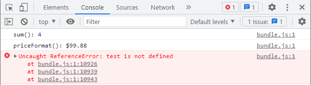
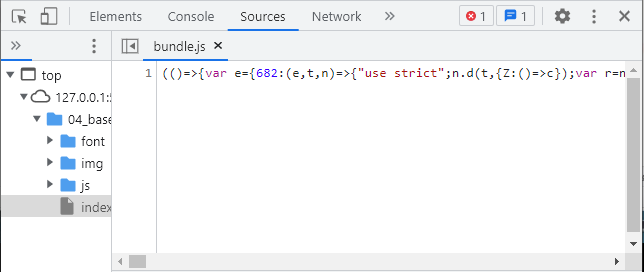
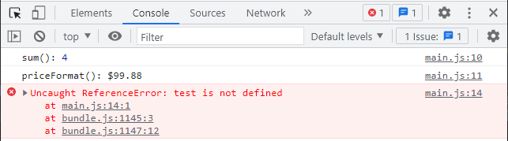
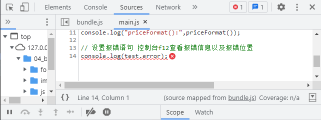

## webpack概念
- `loader`：loader相当于一个帮助库，帮助我们去加载或转换某些模块
- `plugin`：plugin插件可以执行更为广泛的任务，可以完成loader完成不了的事(打包优化、资源管理、环境变量注入)，贯穿整个webpack的生命周期
- `public` 文件夹在项目中一般除了`index.html(模板)`之外，都是直接复制过去dist打包后的文件夹中例如favicon.icon这种图标文件

&emsp;

## webpack安装
npm基于node环境运行，必须先安装好node环境v12版本以上才可
- `npm install webpack webpack-cli -g` 全局安装webpack(学习时)

- `npm install webpack webpack-cli -D` 项目内局部安装，-D(--save-dev简写)代表该包仅在开发环境下使用，如果不加-D则代表在生产环境下使用，不区分也没关系不影响运行，但是为了规范最好区分包的用途是在生产还是在开发阶段。

&emsp;

## webpack打包项目(*.js)
打包流程：
- 1、当执行webpack打包指令后，如果项目目录下有创建 `webpack.config.js` 配置文件的话，就会去到配置文件找自定义的配置信息进行配置(如自定义入口出口)
- 2、如果没有创建webpack.config.js配置文件的话webpack会默认去到src文件夹中找index.js(入口)，根据index.js文件中的依赖，再进一步往下打包，生成dist文件夹(出口)。

&emsp;

### webpack 打包指令
- `webpack` 直接输入执行webpack是从`全局`去找项目进行打包，生产dist文件夹

- `npx webpack` npx会优先找`当前项目`的node_modules里的webpack文件去打包当前项目

- `package.json` (npm init生成) 在包的配置文件中配置 `scripts:{"build":"webpack"}` 这样就很方便，执行指令 `npm run build` 即可完成打包，为什么这边对当前项目打包不需要加上 `npx` 呢，这是因为在package.json中配置命令后，会默认优先找本地的node_modules下的webpack文件进行项目打包。


&emsp;

### webpack 自定义打包的入口与出口
- 在 `webpack.config.js` 配置文件中配置webpack的入口文件和出口目录，需要注意的是由于webpack由node开发，所以读取config文件也是node的方式读取，就不能写ES6的相关语法，如导入导出文件的ES6写法(import、export)，需要用node模块化的导入导出写法。

```js
const path = require("path")

module.exports = {
    entry: "./src/main.js",   // 入口文件
    output: path.resolve(__dirname,"./build"), // 出口目录
    filename: "bundle.js"   // 打包后的js文件名称
}
```

&emsp;


## Loader
- loader加载顺序很重要，需要注意！，asset module type则无需顺序要求
### webpack打包css文件(*.css)
- 1、 `npm install css-loader -D` 安装css-loader库,用于加载css文件

- 2、 `npm install style-loader -D` 安装style-loader库，由于渲染样式，没有style-loader，css也是不起作用的

- 3、在 `webpack.config.js` 中使用module.rules属性，配置loader所要匹配的文件和loader的加载顺序(从后往前，先加载的loader要写在最后)
```js
const path = require('path')
module.exports = {
    entry: "./src/main.js",
    output:{
        path:path.resolve(__dirname,"./build"),
        filename:"bundle.js"
    },
    module:{    // 配置loader插件
        rules:[
            {
                test: /\.css$/, // 正则表达式 匹配css文件
                // 1、写法1(语法糖) 使用单个loader。只有css-loader(只负责加载css文件) css样式还是不起作用所以这边用写法2
                // loader: "css-loader"
                
                // 2、完整写法2 一种文件类型使用多个loader处理
                // 多个loader是有执行顺序的，从后往前，所以css-loader要在最后
                use:[
                    "style-loader",
                    "css-loader"
                ]
            }
        ]
    }
}
```

&emsp;

### webpack打包less文件(*.less)
- `npm install less-loader -D` 打包less文件依赖于lessc这个包，但是我们可以直接装less-loader，内部会直接帮我们执行lessc对less文件进行转义打包
- 配置方式与css-loader一样,由于需要先找到less文件再将其转为css文件再渲染样式，所以这边依赖了三个loader，顺序很重要，不能乱放！
```js
module:{    // 配置loader插件
    rules:[
        {
            test: /\.less$/,
            use:[
                "style-loader",
                "css-loader",
                "less-loader"
            ]
        }
    ]
}
```

&emsp;

### webpack打包图片文件
### file-loader webpack5写法
1、图片显示
- 在webpack5中file-loader、url-loader都给更新成了Asset Modules type，之前都是需要安装相应的loader后再配置rules，图片或者其他静态文件才能够进行打包，但是在webpack5的版本中，安装后配置rules反而不显示图片，不安装反倒显示图片！。
- webpack5现在无需安装loader，使用Asset Modules type即可打包并显示图片，使用方法如下：
```js
module:{
    rules:[
        {
            test: /\.(jpe?g|png|gif)$/i,
            type: 'asset/resource'
        }
    ]
}
```
2、图片路径及名称自定义
- 在 `webpack.config.js` > `output` 下配置 `assetModuleFilename` 即可，写法如下：

- 常用placeholder(占位符)：
    - `[ext]`: 处理文件的扩展名
    - `[name]`: 处理文件的名称
    - `[hash]`: 文件的内容，md4加密处理，生成128位的hash值
    - `[hash:length]`: 截取hash长度，默认32个字符太长了
    - `[path]`: 文件相对于webpack配置文件的路径

- 例：打包后放在img文件夹中，且图片名称格式为 `图片名称.6位hash值.文件后缀名`
```js
output:{
    path:path.resolve(__dirname,"./build"),
    filename:"bundle.js",
    assetModuleFilename: 'img/[name].[hash:6][ext]'
},
```

&emsp;

### url-loader webpack5写法
#### 1、url-loader与file-loader的区别
- url-loader和file-loader的作用一样，都是对静态资源文件做一个打包，唯一不同的是，file-loader不管文件多大或者多小都会直接对文件去打包，那么在实际的浏览器请求服务器页面资源的场景中，如果一个页面有大大小小很多张图片，不管图片大或小，每次都要请求，这样显然是很浪费服务器资源的。
- 鉴于上述资源浪费的问题，url-loader可以让我们指定文件的最大内存，如果文件内存低于我们设置的最大内存，则将文件转为base64编码格式放进js文件中，如果大于则正常打包文件，这样我们就可以把一个个小图片直接转化成编码，节省请求资源的次数，大图片就没必要转，转出来的base64编码也会很大。

#### 2、图片名称路径自定义及文件内存限制
- 注：常用`generator`设置路径，`output->assetModuleFilename`设置路径的方式用的较少，二者选其一即可
```js
module:{
    rules:[
        {
            test: /\.(jpe?g|png|gif)$/i,
            type: 'asset',
            // 路径设置 
            generator: {
                filename: 'img/[name]_[hash:6][ext]'
            },
            // 规则设置
            parser:{
                dataUrlCondition: {
                    // 文件小于100kb就打包成base64编码放进js文件，大图片就不用，小图片转成编码，优化请求资源消耗。
                    maxSize: 100 * 1024
                }
            }
        }
    ]
}
```

&emsp;

### webpack打包字体文件
- 利用webpack5的asset module type方式打包，字体文件一般不需要转为base64编码，所以使用`asset/resouce`类型
```js
module:{
    rules:[
        {
            test: /\.(eot|ttf|woff2?)$/,
            type: 'asset/resource',
            generator:{
                filename: 'font/[name]_[hash:6][ext]'
            }
        }
    ]
}
```

&emsp;

### webpack5 静态资源文件配置参考文章
- [深入 Webpack5 等构建工具系列三(4) - Asset Modules type](https://juejin.cn/post/7002250229705605150)

&emsp;


## Plugins
- plugin顺序无需顺序要求，随意放

### CleanWebpackPlugin 清除文件夹插件
- 作用：在之前打包项目文件的时候，上次打包的内容还会存在，并不会和新的打包内容进行覆盖，也不会先清除原有文件后再添加新文件，而`CleanWebpackPlugin`插件就能做到在打包时先清除打包文件夹。
- `npm install clean-webpack-plugin -D` 安装plugin插件到项目
```js
const {CleanWebpackPlugin} = require('clean-webpack-plugin')

module.exports = {
    ...
    plugins:[
        new CleanWebpackPlugin(),
    ]
}
```

&emsp;

### HtmlWebpackPlugin 打包html模板文件
- 作用：在之前打包项目文件的时候，打包文件夹中并没有index.html的文件，调试时都是在src下的index.html直接打开进行显示，但是在实际的部署场景中，打包后的部署文件夹中是必须要有index.html文件的，而`HtmlWebpackPlugin`插件就能做到创建默认html模板或自定义html模板打包进部署文件夹中并自动引用js文件。
- `npm install html-webpack-plugin -D` 安装plugin插件到项目
```js
const {HtmlWebpackPlugin} = require('html-webpack-plugin')

module.exports = {
    ...
    plugins:[
        // new HtmlWebpackPlugin() 不填写options参数的话则创建默认模板
        new HtmlWebpackPlugin({
            template:'./src/public/index.html', // 模板html文件路径
            title:'html页面title自定义'
        }),
    ]
}
```

&emsp;

### DefinePlugin 声明html中的EJS嵌入式变量
- 作用：在`vue-cli`脚手架模板中，`public/index.html`就是脚手架自动创建的模板文件，我们将该文件直接复制到自己的webpack项目下同样放在public文件夹下，直接执行打包的话会报错，错误信息说是html文件中的`BASE_URL`未定义，这个变量是EJS的语句，那么如何定义声明EJS变量呢？，这就需要用到`DefinePlugin`插件自定义EJS变量。
- 该plugin插件为webpack自带，无需npm安装
```html
<link rel="icon" href="<%= BASE_URL %>favicon.ico">
```

```js
const {DefinePlugin} = require('webpack') 

module.exports = {
    ...
    plugins:[
        new DefinePlugin({
            // BASE_URL:"xxx"写法标识引用xxx这个变量的值
            // 如果想要直接赋值需要在双引号下写单引号再写值"'xxx'"
            BASE_URL:"'./'"
        }),
    ]
}
```

&emsp;

### CopyWebpackPlugin 复制文件到指定文件夹(例：favicon.ico)
作用：在`vue-cli`脚手架模板中，`public/favicon.ico`，在打包的时候需要直接复制过去打包的部署文件夹`dist`中，但是手动复制很麻烦，如果public中还有一些其他的文件那么一个个复制就很繁琐，`CopyWebpackPlugin`插件就可以帮我们将文件自动复制过去，并且可以设置需要省略不复制的文件。


```js
const CopyWebpackPlugin = require('copy-webpack-plugin') 

module.exports = {
    ...
    plugins:[
        new CopyWebpackPlugin({
            patterns:[
                {
                    from:'./src/public',
                    // to: 可省略不写，插件会自动读取配置上下文
                    globOptions:{   // globOptions配置参数
                        ignore:[    // ignore忽略文件
                            "**/index.html"  // **代表./src/public路径下的所有目录
                        ]
                    }
                }
            ]
        })
    ]
}
```

&emsp;

## (掌握)mode和devtool配置项
- 作用：在打包项目文件时，webpack只会检查项目文件的依赖，并不会校验js文件中的语句是否有错，不管有没有错都会打包成功，虽然在浏览器的开发者工具中有错误信息抛出，但是都是指向的`bundle.js`也就是打包压缩之后的js文件，密密麻麻一团(如图1、2所示)，也不知道到底是哪个语句在哪个文件中出错，这就需要配置`mode`和`devtool`,来让代码能够让我们读懂，并且能够指向具体的错误文件及错误语句。

- `mode`：采用哪一种模式进行打包，设置为以`development`生产模式进行打包后，bundle.js文件不被压缩了,需要注意的是，这只是为了开发时调试方便，在准备打包上线时，需要设置`production`模式！

- `devtool`：设置开发时的工具，默认值为`eval`，所以只写mode时，bundle.js包含很多eval函数，要想能看得懂代码就得设置成`source-map`，设置source-map，建立js映射文件，方便调试代码和查看错误信息(f12控制台)
```js
module.exports = {
    // mode与devtool一般都写在webpack配置项的最前面
    mode: "development",
    devtool: "source-map",
}
```




